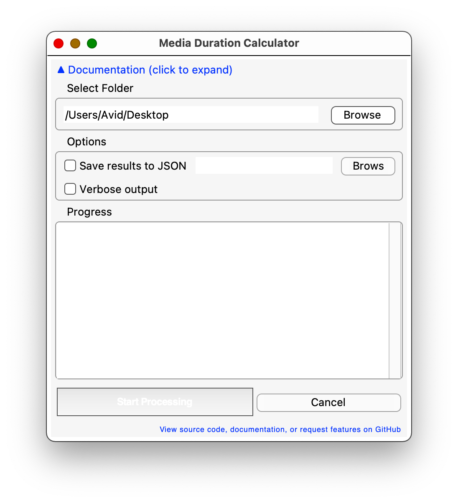

# MediaDurationRecursiveChecker

> Une version anglaise de ce fichier README est disponible : [README.md](README.md)  
> An English version of this README is available: [README.md](README.md)



# MediaDurationRecursiveChecker

Ce script Python calcule la durée totale des fichiers multimédias (vidéo/audio) dans un répertoire et estime le temps total de traitement. Il a été créé pour aider à estimer la durée totale des rushs quotidiens sur un disque dur. Le nom du projet a été changé de FileSizeTreeChecker à MediaDurationRecursiveChecker pour mieux refléter sa fonctionnalité principale.

## Fonctionnalités

- Supporte les formats multimédias courants : `.mp3`, `.mp4`, `.avi`, `.mkv`, `.mov`, `.wav`, `.flac`
- Parcourt les répertoires de manière récursive
- Exclut les fichiers cachés (ceux commençant par '.')
- Fournit :
  - Le nombre total de fichiers multimédias
  - La taille totale en Go
  - La durée totale de tous les fichiers (avec une estimation toutes les 10 fichiers)
  - Sortie détaillée avec les durées individuelles des fichiers
  - Résultats optionnellement sauvegardés dans un fichier JSON

## Prérequis

- Python 3.6+ (seulement testé sur 3.8 et 3.11)
- `moviepy` (pour l'extraction de la durée des médias)
- `pyperclip` (pour gérer le copier-coller du chemin)

## Installation et Utilisation

Vous avez deux options pour exécuter MediaDurationRecursiveChecker :

### 1. Exécuter depuis les sources (interface graphique)
1. Installer les packages Python requis :
```bash
# Sur macOS :
sudo python3 -m pip install moviepy pyperclip

# Sur les autres plateformes :
pip install moviepy pyperclip
```
2. S'assurer que `ffmpeg` est installé sur le système
3. Exécuter le script :
```bash
python MediaDurationRecursiveChecker.py
```
4. Utiliser l'interface graphique pour sélectionner les dossiers et traiter les fichiers

### 2. Compiler votre propre exécutable
Si vous préférez le compiler vous-même :
1. Installer PyInstaller :
```bash
pip install pyinstaller
```
2. Compiler l'exécutable :
```bash
pyinstaller --onefile --name MediaDurationRecursiveChecker MediaDurationRecursiveChecker.py --noconsole --hidden-import=imageio_ffmpeg
```
3. L'exécutable sera dans le répertoire `dist`

Note : Cela a été testé pour fonctionner sur macOS 11 en utilisant la commande :
```bash
sudo pyinstaller --onefile --windowed --name MediaDurationRecursiveChecker MediaDurationRecursiveChecker.py --clean
```

Une version pré-compilée .app pour macOS est disponible dans la release 1.0.1.

## Exemple de sortie

```
1234 fichiers multimédias trouvés (456.78 Go)
Traitement des fichiers : 100%|████████████████████| 1234/1234 [12:34<00:00,  1.23it/s]
Actuel : 12h 34m | Total estimé : 15h 30m

Durée totale : 15h 30m
Résultats sauvegardés dans media_durations.json
```

## Format de sortie JSON

Le fichier JSON de sortie contient :
```json
{
  "/chemin/vers/fichier.mp4": {
    "duration": 3600,  // en secondes
    "size": 1048576   // en octets
  },
  ...
}
```

## Notes

- Les fichiers sont traités dans un ordre aléatoire pour fournir de meilleures estimations de temps
- Le script gère les erreurs avec élégance, en sautant les fichiers qu'il ne peut pas traiter
